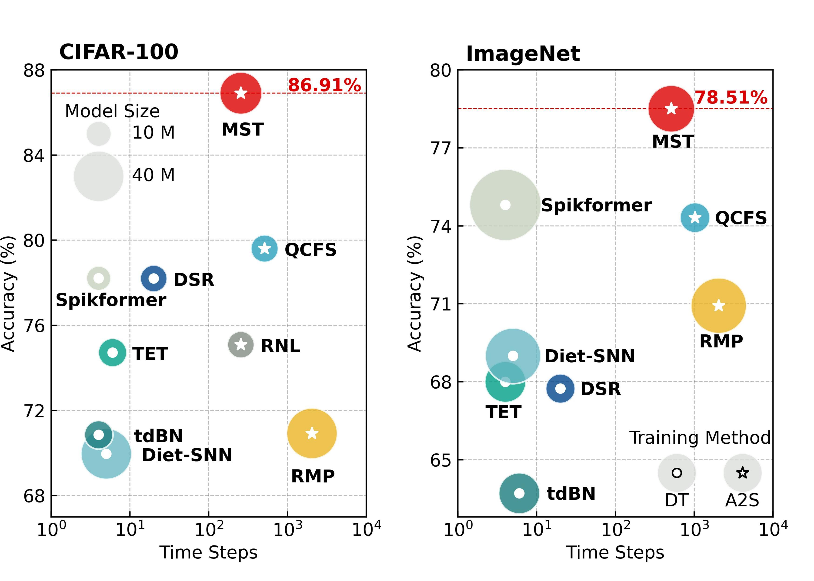

## Masked Spiking Transformer (ICCV-2023)

### *checkpoints will be released soon!*

### Abstract
The combination of Spiking Neural Networks (SNNs) and Transformers has attracted significant attention due to their potential for high energy efficiency and high-performance nature. However, **there still remains a considerable challenge to achieving performance comparable to artificial neural networks in real-world applications**
 To address this issue, we propose to leverage the benefits of the ANN-to-SNN conversion method to combine SNNs and Transformers, resulting in significantly improved performance over existing state-of-the-art SNN models. Furthermore, inspired by the quantal synaptic failures observed in the nervous system, which reduce the number of spikes transmitted across synapses, we introduce a novel Masked Spiking Transformer (MST) framework. This incorporates a Random Spike Masking (RSM) method to prune redundant spikes and reduce energy consumption without sacrificing performance. Our experimental results demonstrate that the proposed MST model achieves a significant reduction of 26.8% in power consumption when the masking ratio is 75% while maintaining the same level of performance as the unmasked model.




The paper is available at [ICCV-23](https://openaccess.thecvf.com/content/ICCV2023/html/Wang_Masked_Spiking_Transformer_ICCV_2023_paper.html). 
### Running the Code

#### 1. Pre-training ANN MST with QCFS function on ImageNet with multiple GPUs:
```bash
python -m torch.distributed.launch --nproc_per_node 8 main.py --cfg configs/mst/MST.yaml --batch-size 128
```

#### 2. SNN Validation:
```bash
python -m torch.distributed.launch --nproc_per_node 8 main.py --cfg configs/mst/MST.yaml --batch-size 128 --snnvalidate True --sim_len 128
```
- `--sim_len`: timestep of SNN.
- `--snnvalidate`: enalbes SNN validation.

